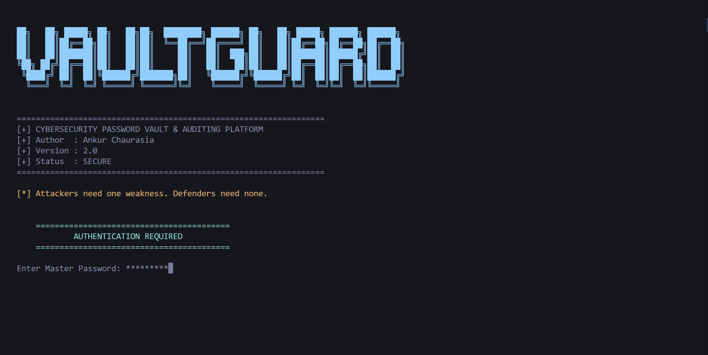
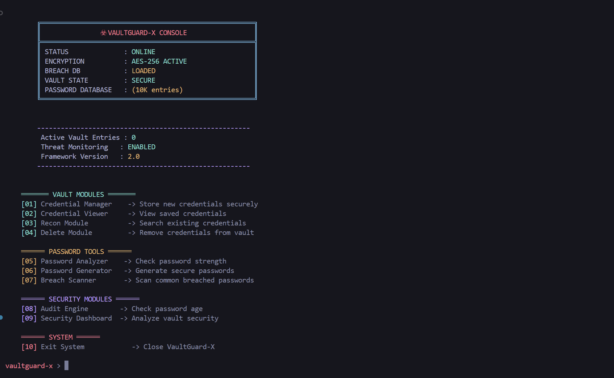
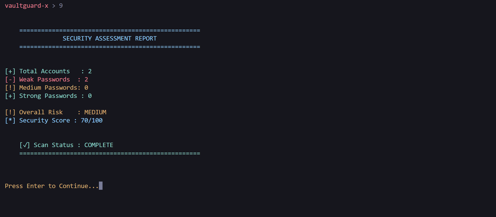

<div align="center">

# ☣️ VaultGuard-X

### A Cybersecurity-Themed Password Manager Built with Python

Securely store credentials, generate strong passwords, detect weak passwords, perform breach checks, and audit your vault — all from a hacker-inspired terminal interface.


</div>

---

## 🚀 Features

* 🔐 **Master Password Authentication** using **bcrypt**
* 🔒 **Encrypted Credential Storage** using **Fernet**
* 👤 Add, View, Search & Delete Credentials
* 🚫 Duplicate Website/Username Protection
* 📊 Password Strength Analyzer
* 🎲 Secure Password Generator
* 🚨 Common Password Breach Scanner
* ⏳ Password Age Audit
* 📈 Security Dashboard & Risk Analysis
* 🎨 Kali Linux / Metasploit Inspired Terminal UI
* 🌍 Cross-Platform Password Input Support
* 📂 Hidden Local Storage for Sensitive Files

---

## 📁 Project Structure

```text
VaultGuard-X/
│
├── vaultguard.py
├── passwords.txt
├── requirements.txt
├── README.md
├── LICENSE
├── .gitignore
│
└── Screenshots/
    ├── startup.png
    ├── menu.png
    └── dashboard.png
```

> Runtime files such as the encrypted vault, master password hash, and encryption key are created automatically inside a hidden `.vault_data` directory.

---

## ⚙️ Installation

Clone the repository:

```bash
git clone https://github.com/YOUR_USERNAME/VaultGuard-X.git
cd VaultGuard-X
```

Install dependencies:

```bash
pip install -r requirements.txt
```

Run the application:

```bash
python vaultguard.py
```

---

## 🛡️ Security Features

* Master passwords are hashed with **bcrypt**.
* Stored credentials are encrypted using **Fernet symmetric encryption**.
* Passwords remain hidden while typing.
* Viewing sensitive credentials requires master password verification.
* Common password database helps identify easily guessable passwords.

---

## 🧰 Built With

* Python 3
* bcrypt
* cryptography (Fernet)
* JSON
* hashlib
* datetime

---

## 📸 Screenshots

### Startup Screen



---

### Main Console



---

### Security Dashboard



---

## 💡 Future Improvements

* Two-Factor Authentication (2FA)
* Password History Tracking
* Encrypted Vault Export/Import
* Automatic Password Rotation Reminders
* GUI Version
* Cloud Backup & Synchronization

---

## 👨‍💻 Author

**Ankur Chaurasia**

Developed as a cybersecurity-focused portfolio project demonstrating encryption, secure credential management, and password auditing concepts.

🔗 LinkedIn: https://www.linkedin.com/in/ankur-chaurasia-aa8738159/

---

If you found this project useful, feel free to ⭐ the repository and connect with me on LinkedIn.
---

## 📜 License

This project is licensed under the MIT License.

Copyright © 2026 Ankur Chaurasia

See the [LICENSE](LICENSE) file for details.
